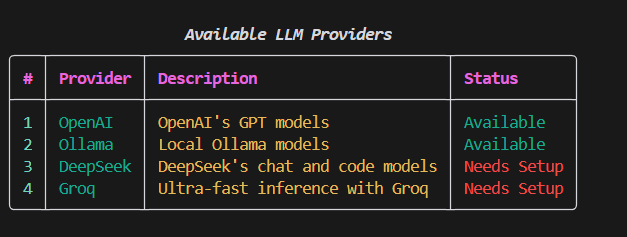

# Lemon-Aid

<div align="center">
  
  
  <h3>🍋 Easy Training Data Generation infused with Citrus! 🍋</h3>
  
  <p><strong>Lemon-Aid v1.0.3</strong></p>

  <p>
    <a href="https://github.com/jakerains/lemon-aid/releases/latest">
      
    </a>
    <a href="LICENSE">
      
    </a>
    <a href="requirements.txt">
      
    </a>
    
    <br/>
    
    
  </p>

  <p>
    <a href="#overview">Overview</a> •
    <a href="#features">Features</a> •
    <a href="#quick-start">Quick Start</a> •
    <a href="#documentation">Docs</a> •
    <a href="#contributing">Contributing</a>
  </p>
</div>

<div align="center">
  
  <p><em>Generate high-quality training data with a beautiful interface</em></p>
</div>

## 🌟 Highlights

> 🚀 **Fast & Efficient**: Asynchronous batch processing with smart rate limiting
>
> 🎯 **Multi-Provider**: Support for OpenAI, DeepSeek, Groq, and local Ollama models
>
> 💡 **Smart Generation**: Dynamic prompt adaptation and duplicate detection
>
> 🛡️ **Robust**: Built-in error handling and progress preservation

<details>
<summary>🎥 Show Demo</summary>
<br>




</details>

## 📋 Table of Contents

- [Overview](#overview)
- [Features](#features)
- [Quick Start](#quick-start)
- [Project Structure](#project-structure)
- [Output Format](#output-format)
- [Error Handling](#error-handling)
- [Next Steps: Fine-tuning with Unsloth](#-next-steps-fine-tuning-with-unsloth)
- [Requirements](#requirements)
- [Contributing](#-contributing)
- [License](#license)
- [Acknowledgments](#-acknowledgments)

## 🔍 Overview

Lemon-Aid is a powerful tool for generating high-quality training data using multiple LLM providers. It features a unified interface for working with various language models, robust error handling, and an intuitive console interface.

## ✨ Features

<table>
<tr>
<td>

### 🔌 Provider Support

- OpenAI (GPT-4o and GPT-4o-mini)
- DeepSeek (Chat and code models)
- Groq (Llama 3.x and Mixtral models)
- Ollama (Local models)

</td>
<td>

### ⚡ Advanced Features

- Async batch processing
- Dynamic prompt adaptation
- Duplicate detection
- Progress saving
- Response length control

</td>
</tr>
</table>

## 🚀 Quick Start

1. Clone the repository:
   ```bash
   git clone https://github.com/jakerains/lemon-aid.git
   cd lemon-aid
   ```

2. Install dependencies:
   ```bash
   pip install -r requirements.txt
   ```

3. Set up your environment:
   - Copy `.env.example` to `.env`
   - Add your API keys for desired providers
   - For Ollama, ensure the service is running locally

4. Run the tool:
   ```bash
   python run.py
   ```

## 📁 Project Structure

```plaintext
lemon-aid/
├── src/               # Source code
│   ├── lemonaid.py    # Main application
│   └── llm_providers.py # Provider implementations
├── assets/            # Images and resources
│   └── lemon-aid-big-ascii-art.txt
├── data/              # Generated data files
│   └── training_data.jsonl
├── docs/              # Documentation
│   ├── CHANGELOG.md
│   └── project-map.md
├── run.py            # Root launcher script
├── requirements.txt   # Python dependencies
└── .env.example      # Environment setup guide
```

## 📤 Output Format

The tool generates training data in JSONL format with special tokens:

```jsonc
{
  "text": "<|im_start|>system\nYou are a knowledgeable assistant...<|im_end|>\n<|im_start|>user\nQuestion here...<|im_end|>\n<|im_start|>assistant\nAnswer here...<|im_end|>"
}
```

## 🛡️ Error Handling

- Graceful shutdown on interruption
- Automatic retry mechanisms
- Rate limit handling
- Progress preservation
- Detailed error tracking

## 🚀 Next Steps: Fine-tuning with Unsloth

After generating your training data JSONL file, you can use [Unsloth](https://docs.unsloth.ai/) to fine-tune your own model. Unsloth makes fine-tuning large language models:
- 2x faster
- Uses 70% less memory
- No degradation in accuracy

### Quick Start with Unsloth
1. Access their [Google Colab notebook](https://colab.research.google.com/drive/1VYkncZMfGFkeCEgN2IzbZIKEDkyQuJAS?usp=sharing) for CSV/Excel fine-tuning
2. Upload your generated JSONL file
3. Follow their tutorial to fine-tune models like:
   - Llama-3
   - Mistral
   - Phi-4
   - Gemma
   - And more!

### Key Features
- Supports multiple chat templates (ChatML, Llama, Alpaca, etc.)
- Automatic Modelfile creation for Ollama export
- Interactive ChatGPT-style interface after fine-tuning
- Export options to GGUF format for local deployment

For detailed instructions, visit [Unsloth's documentation](https://docs.unsloth.ai/basics/tutorial-how-to-finetune-llama-3-and-use-in-ollama).

## 📋 Requirements

- Python 3.8+
- Dependencies:
  ```plaintext
  aiohttp>=3.9.3
  backoff>=2.2.1
  openai>=1.12.0
  rich>=13.7.0
  python-dotenv>=1.0.0
  tqdm>=4.66.2
  ```

## 🤝 Contributing

Contributions are welcome! Please feel free to submit a Pull Request. For major changes, please open an issue first to discuss what you would like to change.

1. Fork the Project
2. Create your Feature Branch (`git checkout -b feature/AmazingFeature`)
3. Commit your Changes (`git commit -m 'Add some AmazingFeature'`)
4. Push to the Branch (`git push origin feature/AmazingFeature`)
5. Open a Pull Request

## 📄 License

This project is licensed under the MIT License - see the [LICENSE](LICENSE) file for details.

## 🙏 Acknowledgments

- OpenAI, DeepSeek, Groq, and Ollama for their APIs
- All contributors and users of this project 

## 📚 Documentation

<details>
<summary>📖 Detailed Documentation</summary>

- [Full Documentation](docs/README.md)
- [Changelog](docs/CHANGELOG.md)
- [Project Map](docs/project-map.md)
- [Contributing Guidelines](CONTRIBUTING.md)

</details>

---

<div align="center">
  <p>Made with 🍋 by <a href="https://github.com/jakerains">Jake Rains</a></p>
  <p>
    <a href="https://github.com/jakerains/lemon-aid/issues">Report Bug</a>
    ·
    <a href="https://github.com/jakerains/lemon-aid/issues">Request Feature</a>
  </p>
</div> 